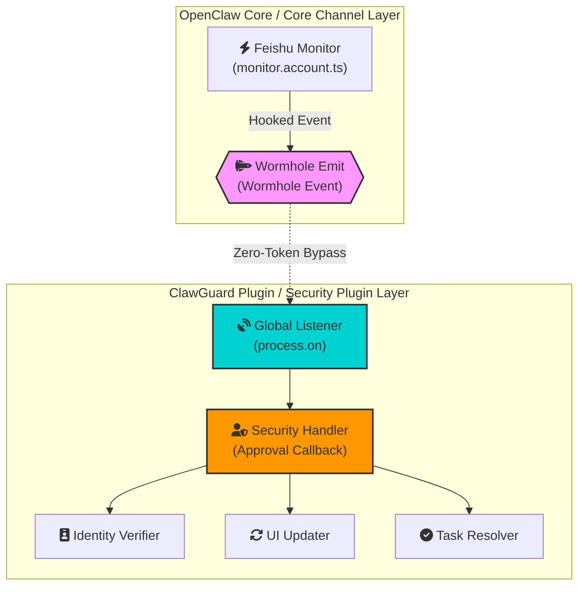
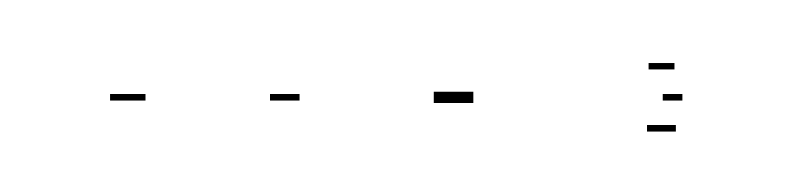
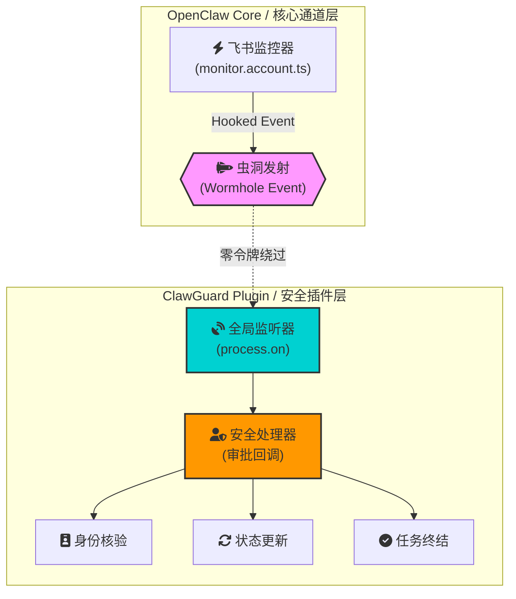

# ClawGuard-Feishu

Feishu Zero-Trust Security Approval Gateway for OpenClaw

[](https://opensource.org/licenses/MIT)
[](https://github.com/openclaw/openclaw)
[](https://open.feishu.cn/)
[](https://github.com/EdwardHaoz/clawguard-feishu)

[English](#english) | [中文](#chinese)

---

<a name="english"></a>

## Introduction

ClawGuard-Feishu is a **Zero-Trust Security Gateway** plugin for OpenClaw Feishu channels. It intercepts tool calls from non-admin users (Guests) and enforces admin approval through interactive Feishu cards before execution.

## Architecture

### Wormhole Event Injection

The plugin uses a unique **Wormhole Injection** mechanism to capture card button clicks without LLM token overhead:



> **Wormhole Workflow Specification**
> - [x] **Upstream Interception**: Intercept at the source by modifying `monitor.account.ts` before events reach LLM routing
> - [x] **Event Tunneling**: Use Node.js global `process` object for cross-module signal transmission (0 Token overhead)
> - [x] **Autonomous Handling**: Plugin layer listens for signals, executes identity verification, UI state PATCH, and final `resolve/reject`

### D2 Industrial Architecture

```d2
direction: right
vars: {
  d2-config: {
    layout-engine: elk
    theme: 200
  }
}

# Feishu Cloud Layer
Feishu Cloud: {
  shape: cloud
  Label: "Feishu Cloud / 飞书云端"
  style: {
    fill: "#00D1D1"
    stroke: "#00a8a8"
    stroke-width: 3
  }
}

# OpenClaw Core Runtime
OpenClaw Core: {
  Label: "OpenClaw Runtime\nOpenClaw 核心进程"
  style: {
    fill: "#1e1e2e"
    stroke: "#cdd6f4"
    stroke-dash: 5
    stroke-width: 2
  }

  Monitor: {
    Label: "Feishu Monitor\nmonitor.account.ts"
    shape: hexagon
    style: {
      fill: "#f38ba8"
      stroke: "#cba6f7"
    }
  }

  Wormhole: {
    Label: "Wormhole Pipeline\n虫洞事件发射器"
    shape: hexagon
    style: {
      fill: "#6366f1"
      stroke: "#4f46e5"
      stroke-width: 3
    }
  }
}

# Security Plugin Zone
ClawGuard Plugin: {
  Label: "ClawGuard-Feishu / 安全插件隔离区"
  style: {
    fill: "#10b981"
    stroke: "#059669"
    stroke-width: 3
  }

  Listener: {
    Label: "Global Listener\nprocess.on"
    shape: rectangle
    style: { fill: "#14b8a6" }
  }

  Handler: {
    Label: "Security Handler\n审批回调处理器"
    shape: shield
    style: { fill: "#f59e0b" }
  }

  Verifier: "Identity Verifier"
  Updater: "UI Updater"
  Resolver: "Task Resolver"
}

# Connections
Feishu Cloud -> OpenClaw Core.Monitor: "Card Action Click"
OpenClaw Core.Monitor -> OpenClaw Core.Wormhole: "process.emit()"
OpenClaw Core.Wormhole -> ClawGuard.Listener: "Zero-Token Bypass"
ClawGuard.Listener -> ClawGuard.Handler
ClawGuard.Handler -> ClawGuard.Verifier: "Verify Admin"
ClawGuard.Handler -> ClawGuard.Updater: "PATCH UI"
ClawGuard.Handler -> ClawGuard.Resolver: "resolve/reject"
```

> **Export to SVG**: Copy the D2 code above and paste it at [d2lang.com](https://d2lang.com) to generate a stunning vector diagram.



### Console Dashboard View

```plaintext
┌─────────────────────────────────────────────────────────────────────────────┐
│  🛡️  ClawGuard-Feishu Architecture / 架构总览                              │
├─────────────────────┬─────────────────────────────────┬───────────────────┤
│  📡 FEISHU CLOUD    │  ⚡ OPENCLAW CORE               │  🛡️ PLUGIN ZONE   │
├─────────────────────┼─────────────────────────────────┼───────────────────┤
│                     │                                 │                   │
│  ┌───────────────┐  │  ┌─────────────────────────┐   │  ┌─────────────┐  │
│  │  Card Button  │──┼─▶│  monitor.account.ts     │───┼─▶│  Listener   │  │
│  │  Click Event  │  │  │  [Hooked Interceptor]   │   │  │  (process)  │  │
│  └───────────────┘  │  └───────────┬─────────────┘   │  └──────┬──────┘  │
│                     │              │                  │         │         │
│                     │              ▼                  │         ▼         │
│                     │  ┌─────────────────────────┐   │  ┌─────────────┐  │
│                     │  │  🌀 Wormhole Emit       │   │  │  🛡️ Handler │  │
│                     │  │  process.emit()         │───┼─▶│  (Approval)  │  │
│                     │  │  [Zero-Token Bypass]   │   │  └──────┬──────┘  │
│                     │  └─────────────────────────┘   │         │         │
│                     │                                 │    ┌─────┼─────┐   │
│                     │                                 │    ▼     ▼     ▼   │
│                     │                                 │  [✓]   [⟳]   [●]  │
│                     │                                 │ Verify Update Resolve │
└─────────────────────┴─────────────────────────────────┴───────────────────┘
```

> **Key Highlights:**
> - `monitor.account.ts` - Kernel-level hook before LLM routing
> - `Wormhole Emit` - Node.js process event bypass (0 token cost)
> - `Security Handler` - Admin identity verification + UI patch + task resolution

## Features

- **Guest Tool Interception**: Automatically intercept tool calls from non-admin users
- **Feishu Card Approval**: Push approval requests to admin via interactive cards
- **Complete Audit Logs**: JSONL-based operation logging with query support
- **Silent Interception**: Blocks LLM redundant replies automatically

## Quick Start

### Prerequisites

- Node.js >= 14
- OpenClaw initialized (`openclaw init`)
- Feishu Enterprise App (obtain `app_id` and `app_secret`)

### Installation

```bash
# Direct install (will prompt for Admin Open ID)
npx clawguard-feishu install

# Install with parameters
npx clawguard-feishu install --admin=ou_xxxxx --root=~/.openclaw
```

### Admin Configuration

```bash
# Secure admin setup (Recommended)
npx clawguard-feishu setup-admin

# Options:
# 1. Query by phone number (most secure)
# 2. Query by email
# 3. Manual input (if you know the OpenID)
# 4. Get from audit logs after plugin runs
```

### View Logs

```bash
# View last 20 logs
npx clawguard-feishu logs

# View last 50 logs
npx clawguard-feishu logs --tail=50

# Filter by action type
npx clawguard-feishu logs --action=approval_request
```

### Uninstall

```bash
npx clawguard-feishu uninstall

# Keep audit logs
npx clawguard-feishu uninstall --keepLogs=true
```

## Configuration

Configure in `plugins.entries.clawguard-feishu`:

```json
{
  "enabled": true,
  "config": {
    "admin_open_id": "ou_xxxxx",
    "language": "en",
    "log_level": "info"
  }
}
```

Feishu API config in `channels.feishu`:

```json
{
  "channels": {
    "feishu": {
      "appId": "cli_xxxxx",
      "appSecret": "xxxxx"
    }
  }
}
```

### Configuration Options

| Option | Type | Description |
|--------|------|-------------|
| `admin_open_id` | string | Admin's Feishu Open ID (starts with ou_) |
| `language` | string | Card language: `en` or `zh` (default: en) |
| `log_level` | string | Log level: `debug`, `info`, `warn`, `error` |

## CLI Commands

| Command | Description |
|---------|-------------|
| `install` | Install plugin to OpenClaw |
| `uninstall` | Uninstall plugin |
| `setup-admin` | Securely configure admin OpenID (Recommended) |
| `logs` | View audit logs |

## License

MIT

---

<a name="chinese"></a>

# ClawGuard-Feishu

飞书零信任安全审批网关 for OpenClaw

[English](#english) | [中文](#chinese)

---

## 简介

ClawGuard-Feishu 是用于 OpenClaw 飞书生态的**零信任安全审批网关**插件。它在工具调用执行前拦截非管理员用户（Guest）的请求，并通过交互式飞书卡片强制要求管理员审批。

## 核心架构

### 虫洞事件注入

插件采用独特的**虫洞注入**机制捕获卡片按钮点击，完全避免 LLM Token 损耗：



> **虫洞工作流规范**
> - [x] **上游拦截**: 通过修改 `monitor.account.ts` 源码，在事件进入 LLM 路由前进行底层拦截
> - [x] **事件隧道**: 使用 Node.js 全局 `process` 对象实现跨模块的信号传递（0 Token 损耗）
> - [x] **自主处理**: 插件层监听到信号后，执行身份核验、UI 状态 PATCH 以及任务的最终 `resolve/reject`

### D2 工业级架构

```d2
direction: right
vars: {
  d2-config: {
    layout-engine: elk
    theme: 200
  }
}

# 飞书云端层
飞书云端: {
  shape: cloud
  Label: "Feishu Cloud / 飞书云端"
  style: {
    fill: "#00D1D1"
    stroke: "#00a8a8"
    stroke-width: 3
  }
}

# OpenClaw 核心运行时
OpenClaw 核心: {
  Label: "OpenClaw Runtime\nOpenClaw 核心进程"
  style: {
    fill: "#1e1e2e"
    stroke: "#cdd6f4"
    stroke-dash: 5
    stroke-width: 2
  }

  监控器: {
    Label: "Feishu Monitor\nmonitor.account.ts"
    shape: hexagon
    style: {
      fill: "#f38ba8"
      stroke: "#cba6f7"
    }
  }

  虫洞: {
    Label: "Wormhole Pipeline\n虫洞事件发射器"
    shape: hexagon
    style: {
      fill: "#6366f1"
      stroke: "#4f46e5"
      stroke-width: 3
    }
  }
}

# 安全插件隔离区
ClawGuard 插件: {
  Label: "ClawGuard-Feishu / 安全插件隔离区"
  style: {
    fill: "#10b981"
    stroke: "#059669"
    stroke-width: 3
  }

  监听器: {
    Label: "Global Listener\nprocess.on"
    shape: rectangle
    style: { fill: "#14b8a6" }
  }

  处理器: {
    Label: "Security Handler\n审批回调处理器"
    shape: shield
    style: { fill: "#f59e0b" }
  }

  核验器: "Identity Verifier"
  更新器: "UI Updater"
  终结器: "Task Resolver"
}

# 连接关系
飞书云端 -> OpenClaw 核心.监控器: "Card Action Click"
OpenClaw 核心.监控器 -> OpenClaw 核心.虫洞: "process.emit()"
OpenClaw 核心.虫洞 -> ClawGuard 插件.监听器: "零令牌绕过"
ClawGuard 插件.监听器 -> ClawGuard 插件.处理器
ClawGuard 插件.处理器 -> ClawGuard 插件.核验器: "验证管理员"
ClawGuard 插件.处理器 -> ClawGuard 插件.更新器: "PATCH UI"
ClawGuard 插件.处理器 -> ClawGuard 插件.终结器: "resolve/reject"
```

> **导出 SVG**: 将以上 D2 代码复制并粘贴到 [d2lang.com](https://d2lang.com) 可生成精美的矢量图。


### 控制台仪表盘视图

```plaintext
┌─────────────────────────────────────────────────────────────────────────────┐
│  🛡️  ClawGuard-Feishu 架构总览                                             │
├─────────────────────┬─────────────────────────────────┬───────────────────┤
│  📡 飞书云端         │  ⚡ OpenClaw 核心               │  🛡️ 插件隔离区    │
├─────────────────────┼─────────────────────────────────┼───────────────────┤
│                     │                                 │                   │
│  ┌───────────────┐  │  ┌─────────────────────────┐   │  ┌─────────────┐  │
│  │  卡片按钮     │──┼─▶│  monitor.account.ts    │───┼─▶│  监听器     │  │
│  │  点击事件     │  │  │  [底层钩子拦截器]       │   │  │  (process)  │  │
│  └───────────────┘  │  └───────────┬─────────────┘   │  └──────┬──────┘  │
│                     │              │                  │         │         │
│                     │              ▼                  │         ▼         │
│                     │  ┌─────────────────────────┐   │  ┌─────────────┐  │
│                     │  │  🌀 虫洞发射器         │   │  │  🛡️ 处理   │  │
│                     │  │  process.emit()        │───┼─▶│  (审批回调)  │  │
│                     │  │  [零令牌绕过]          │   │  └──────┬──────┘  │
│                     │  └─────────────────────────┘   │         │         │
│                     │                                 │    ┌─────┼─────┐   │
│                     │                                 │    ▼     ▼     ▼   │
│                     │                                 │  [✓]   [⟳]   [●]  │
│                     │                                 │ 核验   更新   终结   │
└─────────────────────┴─────────────────────────────────┴───────────────────┘
```

> **核心亮点:**
> - `monitor.account.ts` - LLM 路由前的内核级钩子
> - `虫洞发射器` - Node.js process 事件绕过（零 Token 损耗）
> - `安全处理器` - 管理员身份核验 + UI 状态更新 + 任务终结

## 功能特性

- **Guest 用户工具拦截**: 自动拦截非管理员用户的工具调用请求
- **飞书卡片审批**: 通过交互式卡片推送审批请求给管理员
- **完整审计日志**: 基于 JSONL 的操作记录，支持日志查询
- **静默拦截**: 自动阻断 LLM 冗余回复

## 快速开始

### 前置要求

- Node.js >= 14
- OpenClaw 已初始化 (`openclaw init`)
- 飞书企业自建应用（需获取 `app_id` 和 `app_secret`）

### 安装

```bash
# 直接安装（会提示输入 Admin Open ID）
npx clawguard-feishu install

# 指定参数安装
npx clawguard-feishu install --admin=ou_xxxxx --root=~/.openclaw
```

### 管理员配置

```bash
# 安全配置管理员 (推荐)
npx clawguard-feishu setup-admin

# 选项：
# 1. 通过手机号查询 (最安全)
# 2. 通过邮箱查询
# 3. 手动输入 (如果你知道 OpenID)
# 4. 插件运行后从审计日志获取
```

### 查看日志

```bash
# 查看最近 20 条日志
npx clawguard-feishu logs

# 查看最近 50 条
npx clawguard-feishu logs --tail=50

# 按操作类型筛选
npx clawguard-feishu logs --action=approval_request
```

### 卸载

```bash
npx clawguard-feishu uninstall

# 保留审计日志
npx clawguard-feishu uninstall --keepLogs=true
```

## 配置项

在 `plugins.entries.clawguard-feishu` 中配置：

```json
{
  "enabled": true,
  "config": {
    "admin_open_id": "ou_xxxxx",
    "language": "zh",
    "log_level": "info"
  }
}
```

飞书 API 配置在 `channels.feishu` 中：

```json
{
  "channels": {
    "feishu": {
      "appId": "cli_xxxxx",
      "appSecret": "xxxxx"
    }
  }
}
```

### 配置选项

| 选项 | 类型 | 说明 |
|------|------|------|
| `admin_open_id` | string | 管理员的飞书 Open ID（以 ou_ 开头） |
| `language` | string | 卡片语言: `en` 或 `zh`（默认: en） |
| `log_level` | string | 日志级别: `debug`, `info`, `warn`, `error` |

## CLI 命令

| 命令 | 说明 |
|------|------|
| `install` | 安装插件到 OpenClaw |
| `uninstall` | 卸载插件 |
| `setup-admin` | 安全配置管理员 OpenID (推荐) |
| `logs` | 查看审计日志 |

## 许可证

MIT
